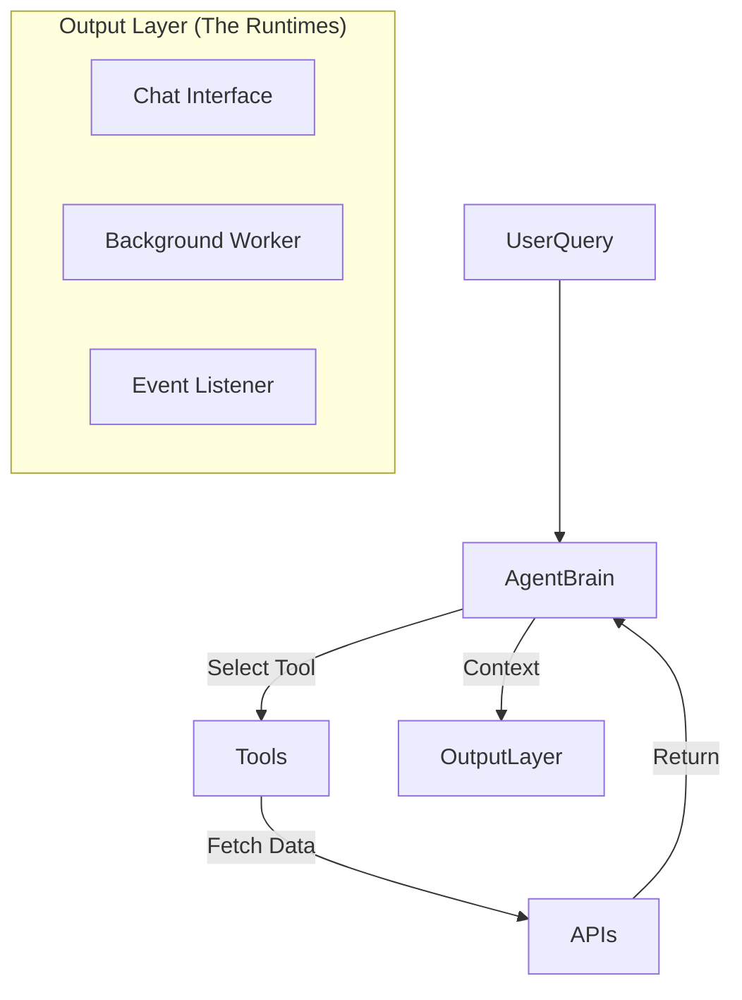

# Agentic Vision: The "Universal Analyst" Roadmap

This document outlines the master plan for evolving the Lynch Stock Screener into a fully agentic "Universal Analyst." It consolidates the 5 families of agents, their architectures, and specific feature capabilities.

> [!NOTE]
> **Core Philosophy**: Move from "User pulls data" (RAG) to "Agent pushes insights" (ReAct). The system shifts from a passive tool to an active partner.

---

## The 5 Agent Families

We categorize agentic capabilities into 5 distinct families based on their trigger ("Push" vs "Pull") and output (Chat, Tags, Notifications, Reports, Strategy).

### I. The "Analyst" (Smart Chat) [Implemented V1]
**Concept**: An interactive, reasoning partner. Instead of just retrieving data, it plans multi-step analyses to answer complex "why" and "how" questions.
*   **Trigger**: User Chat Query (Synchronous)
*   **Output**: Interactive Text/Charts
*   **Key Capability**: Multi-step reasoning (e.g., "Compare X vs Y", "Explain the drop in margin")

### II. The "Hunter" (Agentic Pipeline)
**Concept**: Background screeners that use reasoning to find qualitative patterns. It moves beyond SQL filtering to "semantic screening" (e.g., "Find confident CEOs").
*   **Trigger**: Scheduled Job (Daily/Weekly)
*   **Output**: Database Tags / Watchlists
*   **Key Capability**: Unstructured text analysis at scale (Scanning 5000 transcripts)

### III. The "Watchdog" (Active Monitoring)
**Concept**: A "Sentry" that never sleeps. It monitors live data streams (insider trades, macro data, news) for specific complex triggers and notifies the user.
*   **Trigger**: Event Stream or High-Frequency Cron
*   **Output**: Push Notifications / Alerts
*   **Key Capability**: real-time anomaly detection (e.g., "Stock down 5% but Insiders Buying")

### IV. The "Researcher" (Deep Reports)
**Concept**: An agent that performs hours of work in minutes to produce tangible artifacts. It simulates a junior analyst writing a comprehensive memo.
*   **Trigger**: User Request ("Research this stock")
*   **Output**: Durable Artifacts (PDFs, Markdown Memos)
*   **Key Capability**: Long-horizon task execution and synthesis

### V. The "Strategist" (Portfolio & Simulation)
**Concept**: A portfolio-level advisor that looks at the *whole* rather than the *parts*. It runs simulations and stress tests.
*   **Trigger**: User Request or Market Shift
*   **Output**: Strategic Advice / Rebalancing Suggestions
*   **Key Capability**: Scenario modeling ("What if rates hit 6%?")

---

## Feature Catalog (30 Concepts)

### Family I: The Analyst (Smart Chat)
1.  **Competitive Benchmarker**: "Compare [Ticker] margins to top 3 peers." (Identify peers -> Fetch -> Compare)
2.  **Supply Chain Mapper**: "Who supplies [Ticker]?" (Extracts suppliers from 10-K text)
3.  **Cross-Asset Correlator**: "Why is [Ticker] down?" (Correlate with Oil, 10Y Treasury, Sector ETF)
4.  **Executive Tracker**: "Where else has this CEO worked?" (Track record analysis)
5.  **Transcript Sentinel**: "Sentiment change on 'AI' vs last year?" (Keyword frequency/sentiment over time)
6.  **Guidance Vs. Reality**: "Did they meet their 2022 promises?" (Fact-check past guidance)

### Family II: The Hunter (Pipeline)
7.  **"Founder Mode" Screener**: CEO is Founder + Owns >10% + Positive Sentiment.
8.  **Turnaround Detector**: Negative Earnings but Positive/Growing Operating Cash Flow.
9.  **"Hidden Gem" Finder**: High ROIC (>15%) + No Analyst Coverage + Small Cap.
10. **The "Big Short" Scanner**: Days Sales Outstanding (DSO) rising faster than Revenue (Channel stuffing risk).
11. **Regulatory Risk Scout**: New "Legal Proceedings" in 10-K that weren't there last year.
12. **M&A Target Scout**: Clean balance sheet (Net Cash) + Depressed Valuation + Consolidating Industry.

### Family III: The Watchdog (Monitoring)
13. **Insider Wolf**: CEO/CFO buys >$500k on open market (High conviction signal).
14. **Divergence Monitor**: Price down >5% + Analyst Upgrade/Insider Buy (Contrarian setup).
15. **10-K Diff Alert**: "Risk Factors" section changed >20% vs last year.
16. **Macro Headwind Alert**: Housing Starts drop -> Alert Homebuilder stocks.
17. **Trend Breaker**: Price crosses 200DMA on 2x relative volume.
18. **Hype Spike**: Reddit/Social mentions increase 300% in 24h (Volatility warning).

### Family IV: The Researcher (Artifacts)
19. **The "One-Pager"**: Generates a standard 1-page PDF investment memo (Thesis, Risks, Valuation).
20. **Earnings Prepper**: "Cheat sheet" before earnings (Consensus, Historic Beats/Misses, Key Qs).
21. **Post-Mortem**: "What happened?" report after a >15% drop.
22. **Sector Landscape**: Matrix comparing all sector peers on 10 standardized metrics.
23. **Management Dossier**: Deep dive on executive team compensation and alignment.
24. **Customer Sentiment Audit**: Scrape G2/Trustpilot to gauge product quality vs stock price.

### Family V: The Strategist (Portfolio)
25. **Stress Tester**: "Impact on my portfolio if Recession hits?" (Revenue -10%, Multiples -20%).
26. **Concentration Risk**: "You have 40% correlated exposure to Semiconductors."
27. **"Kill My Thesis"**: Red-team agent that proactively searches for counter-arguments.
28. **Pareto Trimmer**: "Which 20% of positions cause 80% of volatility?"
29. **Income Planner**: "Project dividend income in 10 years w/ Reinvestment."
30. **Buffett Score**: Score portfolio based on quality/value/moat criteria.

---

## Technical Architecture

The core of all 5 families is the **Universal Tool Engine**:

### Shared Toolbox
All families share the same atomic tools capabilities:
*   `get_stock_price` / `get_metrics`
*   `get_earnings_history` / `get_transcripts`
*   `screen_stocks` (The meta-tool)
*   `search_news` / `search_web`
*   `get_peers`
*   `check_insider_activity`

### Next Implementation Steps
1.  **Refine "Smart Chat"**: Fix edge cases (Dates, Universe filtering) [In Progress]
2.  **Build "Watchdog" Foundation**: Create the event loop infrastructure.
3.  **Prototype "Deep Researcher"**: Create a "Generate Memo" command that chains multiple analysis steps and writes a markdown file.
