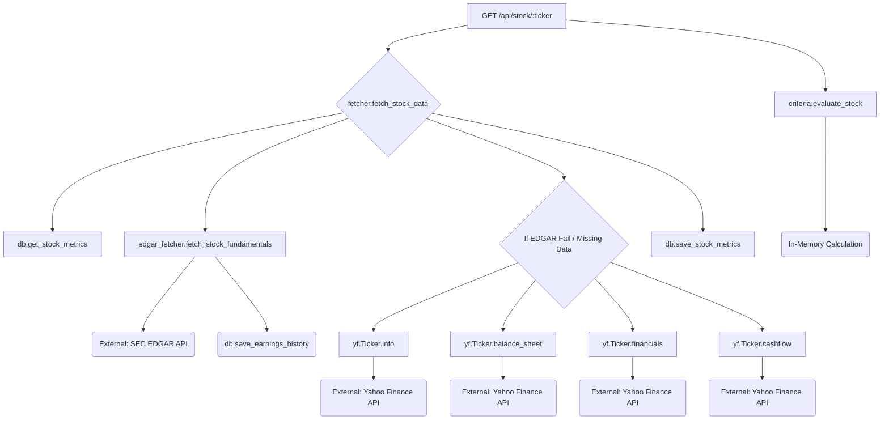
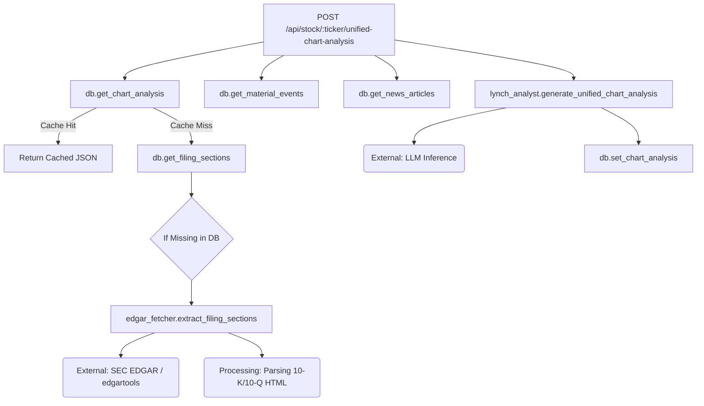
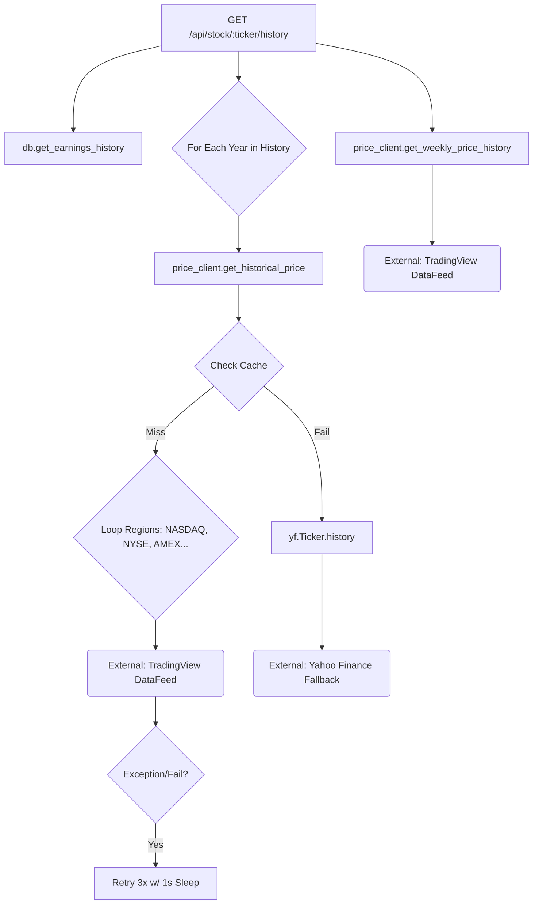
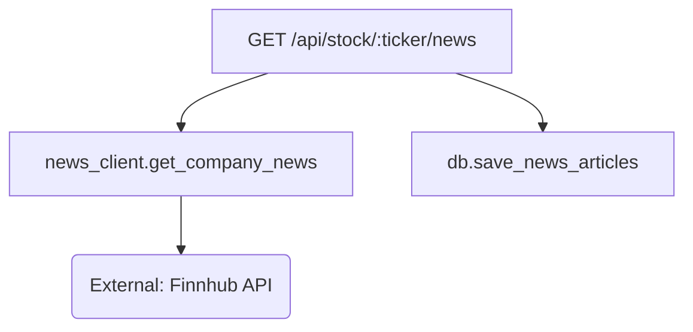
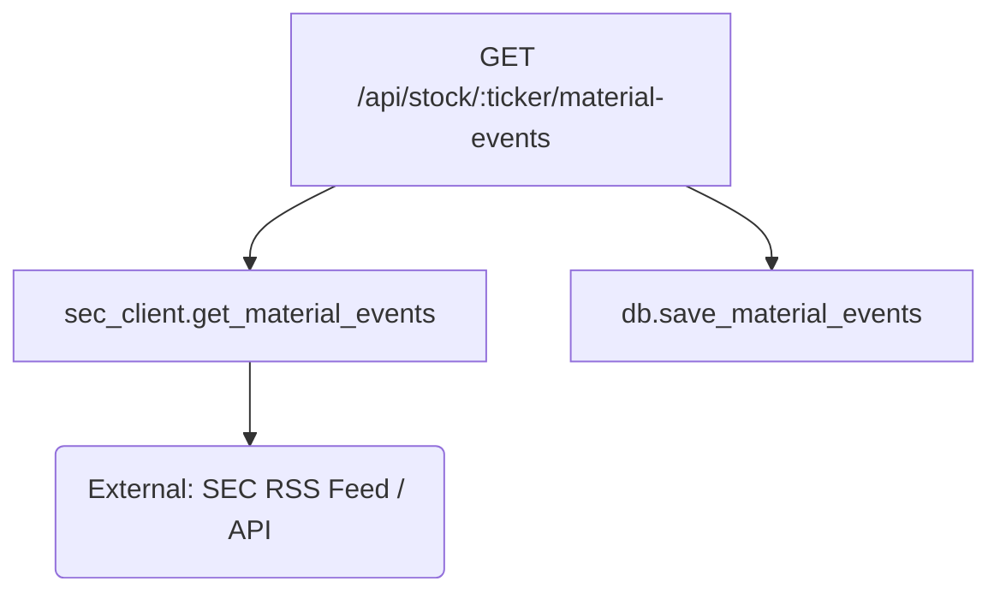

# Stock Detail View: API Call Trees

This document outlines the execution flow for the five critical API endpoints used in the stock detail view. It identifies external calls, blocking operations, and data schemas.

## 1. Get Stock Details
**Endpoint**: `GET /api/stock/<ticker>?algorithm=weighted`
**Handler**: `app.py:get_stock`

### Call Tree


### Bottlenecks
- **Sequential yfinance calls**: `info`, `balance_sheet`, `financials`, `cashflow` are fetched sequentially if EDGAR data is partial or missing.
- **Blocking I/O**: The main thread blocks while waiting for each external API response.

### Return Schema
```json
{
  "stock_data": {
    "symbol": "AAPL",
    "price": 150.00,
    "pe_ratio": 25.5,
    "market_cap": 2500000000,
    "eps_history": [...],
    "revenue_history": [...]
  },
  "evaluation": {
    "score": 85,
    "rating": "Buy",
    "details": {...}
  }
}
```

---

## 2. Unified Chart Analysis
**Endpoint**: `POST /api/stock/<ticker>/unified-chart-analysis`
**Handler**: `app.py:get_unified_chart_analysis`

### Call Tree


### Bottlenecks
- **10-K/10-Q Parsing**: `extract_filing_sections` downloads large HTML files from EDGAR and parses them. This is very slow & CPU intensive.
- **LLM Inference**: Generating the analysis can take 5-10+ seconds depending on the model and prompt size.

---

## 3. Stock History (Charts)
**Endpoint**: `GET /api/stock/<ticker>/history?period_type=annual`
**Handler**: `app.py:get_stock_history`

### Call Tree


### Bottlenecks
- **TradingView Retries**: The "Blind Guess" logic iterates exchanges. If a stock is on the 4th exchange (or none), it retries previous ones 3x with 1s sleeps. This is the **primary suspect for the >10s delay**.
- **Sequential Dates**: It fetches historical price for *every fiscal year end* sequentially.

### Return Schema
```json
[
  {
    "year": 2023,
    "eps": 5.0,
    "revenue": 100000,
    "pe_ratio": 20.0,
    "price": 100.0
  },
  ...
]
```

---

## 4. Stock News
**Endpoint**: `GET /api/stock/COST/news`
**Handler**: `app.py:get_stock_news`

### Call Tree


### Return Schema
```json
[
  {
    "headline": "Costco Earnings Beat Expectations",
    "summary": "...",
    "url": "...",
    "source": "Bloomberg",
    "datetime": 1678888888
  }
]
```

---

## 5. Material Events
**Endpoint**: `GET /api/stock/COST/material-events`
**Handler**: `app.py:get_material_events`

### Call Tree


### Return Schema
```json
[
  {
    "event_type": "8-K",
    "headline": "Entry into a Material Definitive Agreement",
    "description": "...",
    "filing_date": "2023-11-05"
  }
]
```
